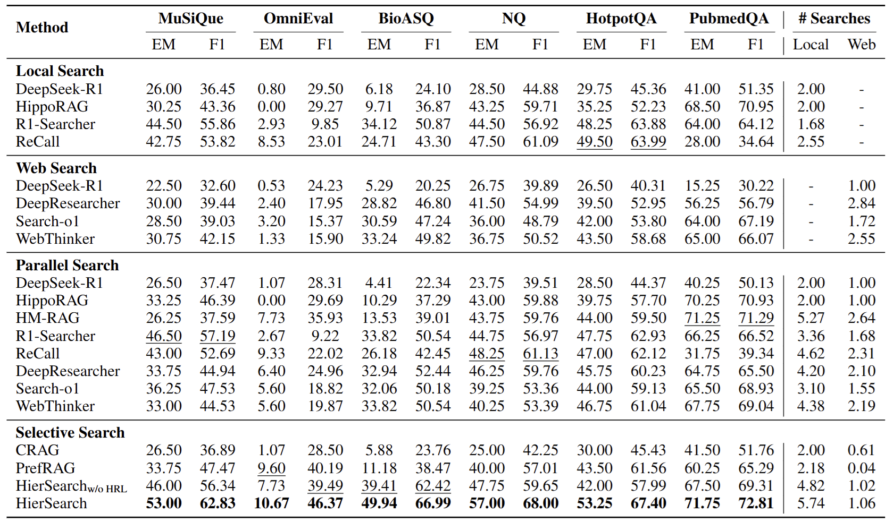

# <div align="center">HierSearch: A Hierarchical Enterprise Deep Search Framework Integrating Local and Web Searches</div>

<div align="center">
<a href="https://arxiv.org/abs/2508.08088" target="_blank"></a>
<a href="https://huggingface.co/papers/2508.08088" target="_blank"></a>
<a href="https://huggingface.co/collections/zstanjj/hiersearch-6889c44cce34aebcdfd73b4a" target="_blank"></a>
<a href="https://www.modelscope.cn/collections/HierSearch-6638ad769ddb44" target="_blank"></a>
<a href="https://github.com/plageon/HierSearch/blob/main/toolkit/LICENSE"></a>
<a></a>

[//]: # ()
<p>
<a href="https://github.com/plageon/HtmlRAG#-quick-start">Quick Start (快速开始)</a>&nbsp ｜ &nbsp<a href="README_zh.md">中文文档</a>&nbsp ｜ &nbsp<a href="README.md">English Documentation</a>&nbsp
</p>
</div>


## 📖 Table of Contents
- [Introduction](#-introduction)
- [News](#-latest-news)
- [Installation](#-installation)
- [Quick Start](#-quick-start)
- [Reproduce Results](#-dependencies)

## ✨ Latest News

- [12/08/2025]: Our paper is aviailable on [arXiv](https://arxiv.org/abs/2508.08088) and [Hugging Face](https://huggingface.co/papers/2508.08088).
- [31/07/2025]: The open-source training and inference are released. You can apply HierSearch now.


## 📝 Introduction

1. We explore the deep search framework in multi-knowledge-source scenarios and propose a hierarchical agentic paradigm and train with HRL; 
2. We notice drawbacks of the naive information transmission among deep search agents and developed a knowledge refiner suitable for multi-knowledge-source scenarios; 
3. Our proposed approach for reliable and effective deep search across multiple knowledge sources outperforms existing baselines the flat-RL solution in various domains.

## 📦 Installation

1. Install required packages
```shell
conda create -n hiersearch python=3.10
conda activate hiersearch
pip install -e .
cd HippoRAG
pip install -e .
```
2. Download required checkpoints
```shell
mkdir model
modelscope download --model zstanjj/HierSearch-Local-Agent --local_dir model/HierSearch-Local-Agent
modelscope download --model zstanjj/HierSearch-Web-Agent --local_dir model/HierSearch-Web-Agent
modelscope download --model zstanjj/HierSearch-Planner-Agent --local_dir model/HierSearch-Planner-Agent
modelscope download --model BAAI/bge-m3 --local_dir model/bge-m3
```

## 🔌 Apply HtmlRAG in your own RAG systems

### 🎯 Quick Start

1. Construct graph

    We have released the constructed graph for six benchmarks we used in our paper.
    Download the graph from the dataset repo on [ModelScope](https://www.modelscope.cn/datasets/zstanjj/HierSearch-Datasets) or [HuggingFace](https://huggingface.co/datasets/zstanjj/HierSearch-Datasets).
    Make a directory named `graph` in each dataset directory, and put the graph files named `openie_results_ner_gpt-4o-mini.json` in it.
    Your directory structure should look like this:
    ```
    data/
    ├── musique/
    │   ├── musique_corpus.json
    │   ├── train.jsonl
    │   ├── test.jsonl
    │   ├── graph/
    │   │   └── openie_results_ner_gpt-4o-mini.json
    ├── omnieval/
    ...
    ```
    If you want to construct the graph by yourself, replace the `DATASET_NAME_corpus.json` and construct the graph from scratch.

    Run the following commands to index the graph and text chunks.
    ```shell
    export OPENAI_API_KEY="YOUR_OPENAI_API_KEY"
    
    export OPENIE_LANG="en" # set to "zh" for Chinese datasets (omnieval, etc.)
    python agentic_rag/construct_graph.py \
        --dataset "DATASET_NAME" \
        --llm_base_url "OPENAI_BASE_URL" \
        --llm_name "gpt-4o-mini" \
        --embedding_name "bge-m3" \
        --force_index_from_scratch "false" \
        --force_openie_from_scratch "false" \
        --openie_mode "online" \
        --save_dir "GRAPH_DIR" \
        --data_dir "data/DATASET_NAME"
    ```

2. Initialize local search server
    ```shell
    export OPENIE_LANG="en" # set to "zh" for Chinese datasets (omnieval, etc.)
    
    python agentic_rag/serve_graph_search.py \
        --num_retriever 1 \
        --port 18009 \
        --dataset_name "DATASET_NAME" \
        --save_dir "data/DATASET_NAME/graph" \
        --llm_model "gpt-4o-mini" \
        --embedding_model_name "bge-m3" \
        --corpus_path "DATASET_NAME/DATASET_NAME_corpus.json" \
        --llm_base_url "OPENAI_BASE_URL"
    ```

3. Initialize Web search server
    ```shell
    python search_utils/web_dedicate_server.py
        --num_retriever 8 \
        --port 15005
    ```

4. Serve agents
   ```shell
   # Serve the local agent on a machine with LOCAL_AGENT_URL
   vllm serve LOCAL_AGENT_PATH \
       --served-model-name HierSearch-Local-Agent \
       --gpu-memory-utilization 0.90 \
       --dtype bfloat16 \
       --trust-remote-code \
       --port 80
   ```
   ```shell 
   # Serve the web agent on a machine with WEB_AGENT_URL
   vllm serve WEB_AGENT_PATH \
       --served-model-name HierSearch-Web-Agent \
       --gpu-memory-utilization 0.90 \
       --dtype bfloat16 \
       --trust-remote-code \
       --port 80
   ```
   ```shell 
   # Serve the planner agent on a machine with PLANNER_AGENT_URL
   vllm serve PLANNER_AGENT_PATH \
       --served-model-name HierSearch-Planner-Agent \
       --gpu-memory-utilization 0.90 \
       --dtype bfloat16 \
       --trust-remote-code \
       --port 80
   ```

5. Serve deep search agent server
    ```shell
    python agentic_rag/serve_search_agent.py \
        --num_agents 8 \
        --port 16006 \
        --local_agent_llm_url "http://LOCAL_AGENT_URL/v1" \
        --web_agent_llm_url "http://WEB_AGENT_URL/v1" \
        --remote_retriever_url "http://127.0.0.1" \
        --remote_web_browse_url "http://127.0.0.1:15005" \
        --remote_web_retriever_url "http://127.0.0.1:15005" \
        --local_agent_llm_model_path "model/HierSearch-Local-Agent" \
        --web_agent_llm_model_path "model/HierSearch-Web-Agent" \
        --local_agent_serve_model_name "HierSearch-Local-Agent" \
        --web_agent_serve_model_name "HierSearch-Web-Agent" \
        --embedding_model_name "bge-m3" \
        --max_turns 8 \
        --single_sample \
        --question "Who is the sibling of the author of Kapalkundala?" \
        --filter_ratio 0.5
    ```

6. Run online inference
    ```shell
    python baselines/online_eval.py \
        --method_name "HierSearch" \
        --data_dir "data" \
        --split "test" \
        --remote_llm_url "http://PLANNER_AGENT_URL/v1" \
        --remote_agent_url "http://127.0.0.1:16006/" \
        --model_path "model/HierSearch-Planner-Agent" \
        --serve_model_name "HierSearch-Planner-Agent" \
        --sys_template_name "planner_agent_template_sys" \
        --max_turns 8
    ```


### 🚀 Reproduce Our Results
We conduct extensive experiments on six benchmarks from the general domain, the medical domain, and the financial domain. 
The results show that HierSearch outperforms baselines and the flat RL solution across all benchmarks.



1. Download dataset
    ```shell
    modelscope download zstanjj/HierSearch-Datasets --local_dir data --repo-type dataset
    ```

2. Run deep search
    ```shell
    python baselines/online_eval.py \
        --method_name "HierSearch" \
        --data_dir "data/DATASET_NAME" \
        --split "test" \
        --remote_llm_url "http://127.0.0.1:18086/v1" \
        --remote_web_retriever_url "http://10.10.15.46:15005/" \
        --remote_agent_url "http://127.0.0.1:16006/" \
        --model_path "PLANNER_AGENT_LLM_MODEL_PATH" \
        --serve_model_name "HierSearch-Planner-Agent" \
        --sys_template_name "planner_agent_template_sys" \
        --max_turns 8
    ```

## 🚀 Training

Download the merged training data from the dataset repo on [ModelScope](https://www.modelscope.cn/datasets/zstanjj/HierSearch-Datasets) or [HuggingFace](https://huggingface.co/datasets/zstanjj/HierSearch-Datasets) named `all_train.parquet` and put it in the `data` directory.

1. Train local search agent
    ```shell
    export PROMPT_TEMPLATE_NAME="local"
    export SUPPORTED_TOOLS="[chunk_search, graph_search, get_adjacent_passages]"
    ./scripts/train_deep_search.sh
    ```

2. Train web search agent
    ```shell 
    export PROMPT_TEMPLATE_NAME="web"
    export SUPPORTED_TOOLS="[web_search, browse_url]"
    ./scripts/train_deep_search.sh
    ```

3. Train planner agent
    ```shell 
    export PROMPT_TEMPLATE_NAME="planner"
    export SUPPORTED_TOOLS="[local_search_agent, web_search_agent, all_search_agent]"
    ./scripts/train_deep_search.sh
    ```

## 📜 Citation

```bibtex
@misc{tan2025hiersearchhierarchicalenterprisedeep,
      title={HierSearch: A Hierarchical Enterprise Deep Search Framework Integrating Local and Web Searches}, 
      author={Jiejun Tan and Zhicheng Dou and Yan Yu and Jiehan Cheng and Qiang Ju and Jian Xie and Ji-Rong Wen},
      year={2025},
      eprint={2508.08088},
      archivePrefix={arXiv},
      primaryClass={cs.IR},
      url={https://arxiv.org/abs/2508.08088}, 
}
```
